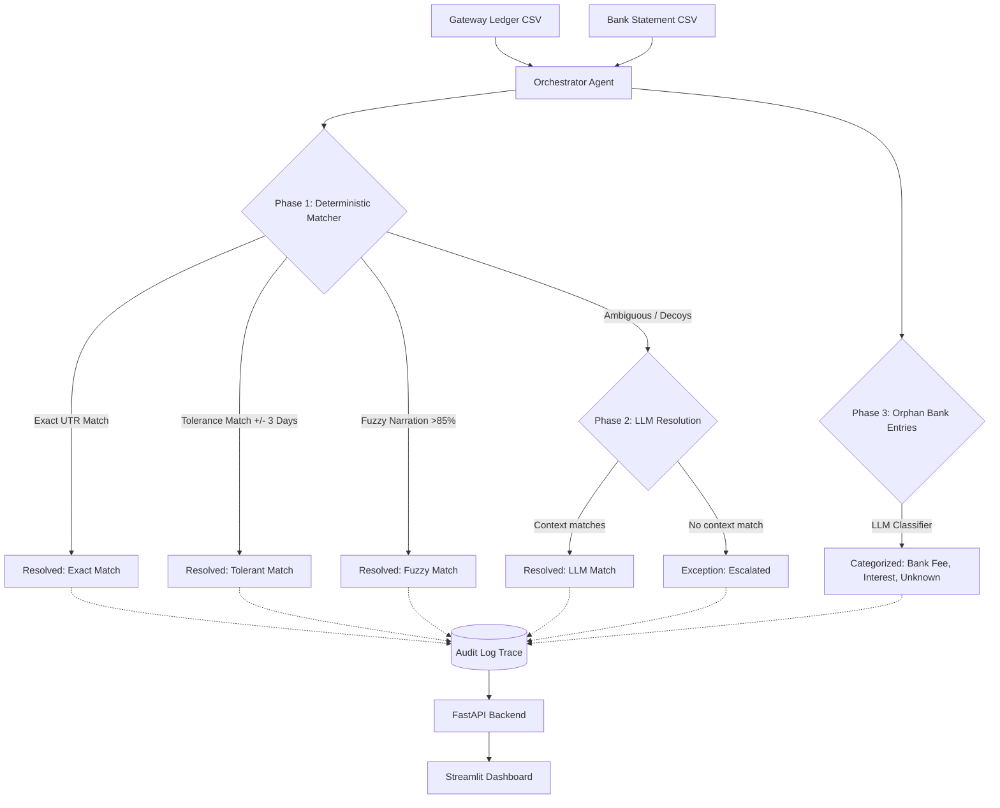

# 💸 AI Finance Controller
**The Enterprise Reconciliation Engine**

**Problem Statement**
Financial reconciliation between payment gateways (like Razorpay/Stripe) and bank statements is a manual, error-prone nightmare. Delayed settlements, noisy bank narrations, and mismatched amounts due to fees or partial refunds cause thousands of hours of wasted accounting effort and false positive matches.

**The Solution**
AI Finance Controller is an agentic, end-to-end reconciliation pipeline. It acts as an autonomous accountant—running deterministic rules for exact matches, applying fuzzy logic for tolerant matches, and selectively escalating ambiguous "decoy" transactions to an LLM (Claude) for semantic resolution. It produces a 100% transparent audit trail for every single transaction.


https://ai-finance-controller-rajeev.streamlit.app/
---

## 🏗️ Architecture



---

## 🚀 How to Run Locally

You can run the entire pipeline locally without any heavy dependencies.

**1. Clone and Setup**
```bash
git clone https://github.com/23f3002112/AI_Finance_Controller.git
cd AI_Finance_Controller
python -m venv venv
source venv/bin/activate  # On Windows: venv\Scripts\activate
pip install -r requirements.txt
```

**2. Configure Environment**
Create a `.env` file in the root directory:
```bash
ANTHROPIC_API_KEY=your_api_key_here
```
*(Note: If you don't have an API key, the system has a built-in smart mock that will simulate the LLM's reasoning for local testing!)*

**3. Generate Synthetic Data**
```bash
cd data
python generate_synthetic_data.py --n 250 --seed 42
cd ..
```

**4. Start the Backend API**
```bash
cd backend
uvicorn api:app --host 127.0.0.1 --port 8000
```

**5. Start the Frontend Dashboard**
In a new terminal:
```bash
streamlit run frontend/app.py
```
Upload the generated `data/gateway_ledger.csv` and `data/bank_statement.csv` via the UI!

---

## 📊 Performance & Results

On our final evaluation dataset (206 Gateway Transactions, heavily injected with adversarial decoys and noisy bank text):

- **Match Rate:** 85.9%
- **Precision:** 97.2%
- **Orphaned Records Classified:** 42 (Bank fees, interest, etc.)

**Resolution Breakdown:**
- Exact UTR: ~104
- Tolerant Amount/Date: ~20
- Fuzzy Narration: ~44
- LLM Resolved: ~9
- Exceptions: ~29

---

## 🛠️ What Broke & How I Fixed It

Building a resilient agentic system is hard. Here are the biggest challenges we faced and solved during development:

1. **The "Decoy" Duplicate Bug:** In Milestone 3, our deterministic engine kept matching the wrong bank entry when two different customers paid the exact same amount on the exact same day. **Fix:** We implemented a multi-pass pipeline. Strict exact matches run first and remove candidates from the pool, leaving the decoys to be handled by the LLM which can read the semantic context of the narration to reject false positives.
2. **The Ground Truth API Crash:** When we moved the Orchestrator to the FastAPI server, it immediately crashed. Why? Because the orchestrator was hardcoded to look for a `ground_truth.csv` file to calculate precision, which doesn't exist when a user uploads raw files via the UI. **Fix:** We made the orchestrator defensively check for the evaluation files, gracefully skipping the precision calculation in production while maintaining it for local benchmarking.
3. **The Real-World Messy Text (Unicode) Bug:** When scaling up our synthetic data generation to 500 records, the pandas CSV reader threw a fatal `UnicodeDecodeError`. Fake banking text generated a weird character. **Fix:** We updated the `load_data` function to use `encoding_errors="replace"`, a standard enterprise safeguard against messy legacy banking systems.

---

## 🔮 What's Next?
If we had more time, we would build:
- **Real PDF Ingestion:** Add an OCR/Vision layer to ingest unstructured bank statement PDFs directly.
- **Multi-Currency Support:** Add dynamic forex API lookups for cross-border reconciliation tolerances.
- **Human-in-the-Loop Feedback:** Allow users to manually resolve exceptions in the UI, feeding those decisions back into a Vector DB to fine-tune the LLM for future runs.
